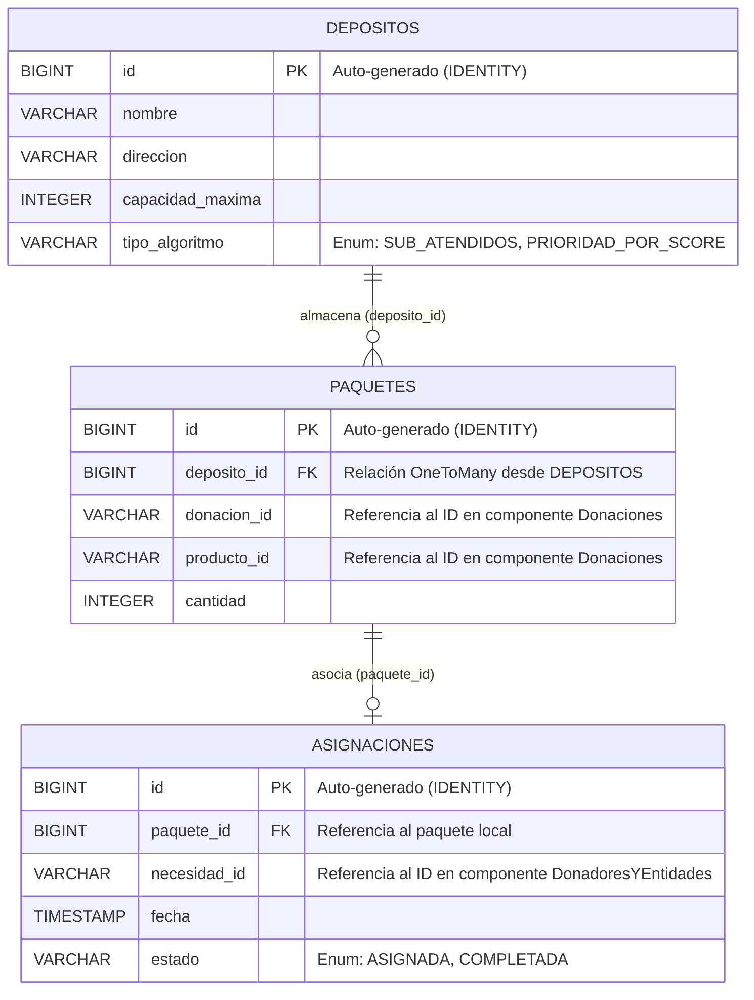

```mermaid
erDiagram

    DEPOSITOS {
        BIGINT id PK "Auto-generado (IDENTITY)"
        VARCHAR nombre
        VARCHAR direccion
        INTEGER capacidad_maxima
        VARCHAR tipo_algoritmo "Enum: SUB_ATENDIDOS, PRIORIDAD_POR_SCORE"
    }

    PAQUETES {
        BIGINT id PK "Auto-generado (IDENTITY)"
        BIGINT deposito_id FK "Relación OneToMany desde DEPOSITOS"
        VARCHAR donacion_id "Referencia al ID en componente Donaciones"
        VARCHAR producto_id "Referencia al ID en componente Donaciones"
        INTEGER cantidad
    }

    ASIGNACIONES {
        BIGINT id PK "Auto-generado (IDENTITY)"
        BIGINT paquete_id FK "Referencia al paquete local"
        VARCHAR necesidad_id "Referencia al ID en componente DonadoresYEntidades"
        TIMESTAMP fecha
        VARCHAR estado "Enum: ASIGNADA, COMPLETADA"
    }

%% Relaciones de Base de Datos
    DEPOSITOS ||--o{ PAQUETES : "almacena (deposito_id)"
    PAQUETES ||--o| ASIGNACIONES : "asocia (paquete_id)"
```