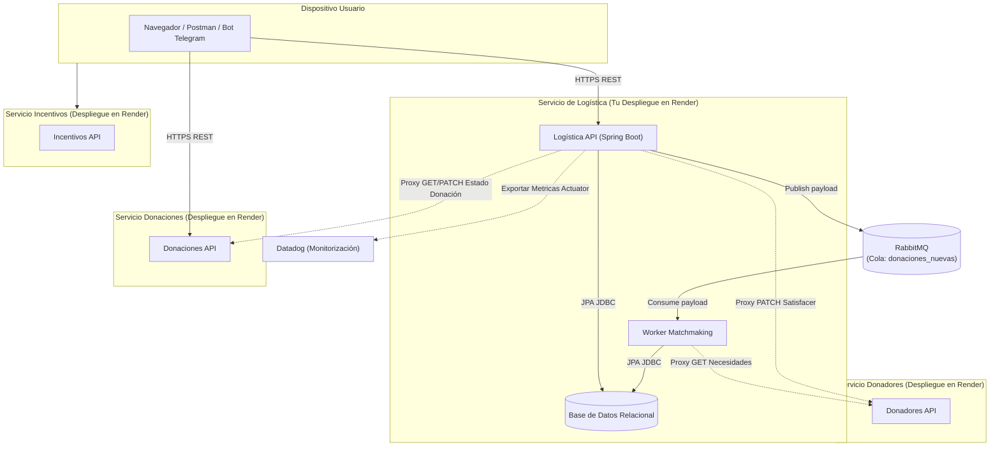

```mermaid
flowchart TB
 subgraph ClienteNode["Dispositivo Usuario"]
        ClienteComp["Navegador / Postman / Bot Telegram"]
  end
 subgraph LogisticaNode["Servicio de Logística (Tu Despliegue en Render)"]
        LogisticaComp["Logística API (Spring Boot)"]
        WorkerComp["Worker Matchmaking"]
        DBLog[("Base de Datos Relacional")]
  end
 subgraph DonadoresNode["Servicio Donadores (Despliegue en Render)"]
        DonadoresComp["Donadores API"]
  end
 subgraph DonacionesNode["Servicio Donaciones (Despliegue en Render)"]
        DonacionesComp["Donaciones API"]
  end
 subgraph IncentivosNode["Servicio Incentivos (Despliegue en Render)"]
        IncentivosComp["Incentivos API"]
  end
    ClienteComp -- HTTPS REST --> LogisticaComp & DonacionesComp
    LogisticaComp -- JPA JDBC --> DBLog
    WorkerComp -- JPA JDBC --> DBLog
    WorkerComp -. Proxy GET Necesidades .-> DonadoresComp
    LogisticaComp -. Proxy PATCH Satisfacer .-> DonadoresComp
    LogisticaComp -. Proxy GET/PATCH Estado Donación .-> DonacionesComp
    LogisticaComp -- Publish payload --> RabbitMQ[("RabbitMQ\n(Cola: donaciones_nuevas)")]
    RabbitMQ -- Consume payload --> WorkerComp
    LogisticaComp -. Exportar Metricas Actuator .-> Datadog["Datadog (Monitorización)"]
    ClienteNode --> IncentivosNode
```
