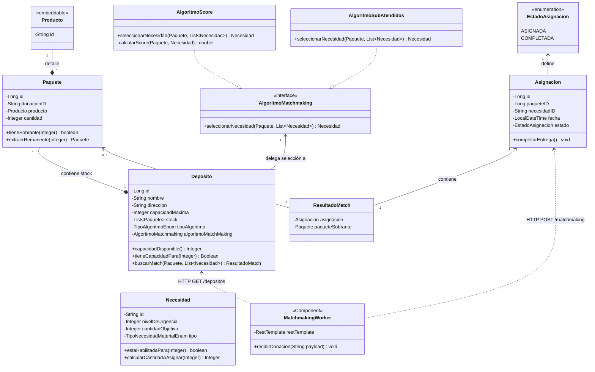

```mermaid
classDiagram
    direction BT

%% Entidades de Dominio y Workers
    class Deposito {
        -Long id
        -String nombre
        -String direccion
        -Integer capacidadMaxima
        -List~Paquete~ stock
        -TipoAlgoritmoEnum tipoAlgoritmo
        -AlgoritmoMatchmaking algoritmoMatchMaking
        +capacidadDisponible() Integer
        +tieneCapacidadPara(Integer) Boolean
        +buscarMatch(Paquete, List~Necesidad~) ResultadoMatch
    }

    class Paquete {
        -Long id
        -String donacionID
        -Producto producto
        -Integer cantidad
        +tieneSobrante(Integer) boolean
        +extraerRemanente(Integer) Paquete
    }

    class Producto {
        <<embeddable>>
        -String id
    }

    class Asignacion {
        -Long id
        -Long paqueteID
        -String necesidadID
        -LocalDateTime fecha
        -EstadoAsignacion estado
        +completarEntrega() void
    }

    class ResultadoMatch {
        -Asignacion asignacion
        -Paquete paqueteSobrante
    }

    class EstadoAsignacion {
        <<enumeration>>
        ASIGNADA
        COMPLETADA
    }

    class Necesidad {
        -String id
        -Integer nivelDeUrgencia
        -Integer cantidadObjetivo
        -TipoNecesidadMaterialEnum tipo
        +estaHabilitadaPara(Integer) boolean
        +calcularCantidadAAsignar(Integer) Integer
    }

    class AlgoritmoMatchmaking {
        <<interface>>
        +seleccionarNecesidad(Paquete, List~Necesidad~) Necesidad
    }

    class AlgoritmoScore {
        +seleccionarNecesidad(Paquete, List~Necesidad~) Necesidad
        -calcularScore(Paquete, Necesidad) double
    }

    class AlgoritmoSubAtendidos {
        +seleccionarNecesidad(Paquete, List~Necesidad~) Necesidad
    }

    class MatchmakingWorker {
        <<Component>>
        -RestTemplate restTemplate
        +recibirDonacion(String payload) void
    }

%% Relaciones
    Deposito "1" *-- "*" Paquete : contiene stock
    Deposito --> "1" AlgoritmoMatchmaking : delega selección a

    Paquete "*" *-- "1" Producto : detalle
    Asignacion --> "1" EstadoAsignacion : define

    ResultadoMatch "1" --> "1" Asignacion : contiene
    ResultadoMatch "1" --> "0..1" Paquete : remanente

    AlgoritmoMatchmaking <|.. AlgoritmoScore
    AlgoritmoMatchmaking <|.. AlgoritmoSubAtendidos

    MatchmakingWorker ..> Deposito : HTTP GET /depositos
    MatchmakingWorker ..> Asignacion : HTTP POST /matchmaking

```
